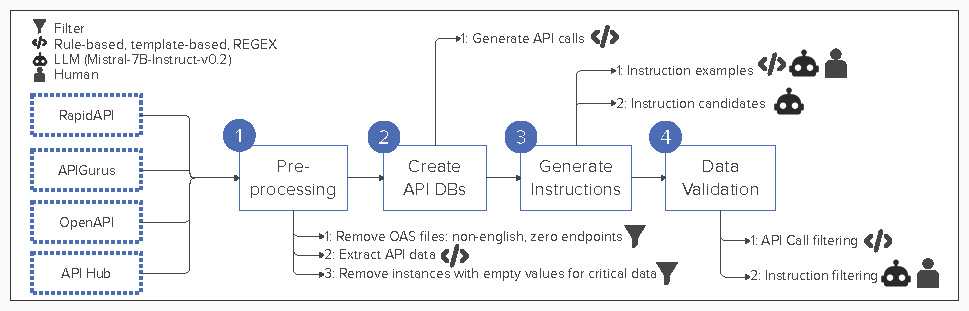

# Processing Pipeline
We follow a pipeline of 4 steps (excluding data collection) to build the *instruction-dataset* used for fine-tuning. At the core, this processing pipeline extracts information from [OpenAPI](https://www.openapis.org/) specification files. Using [OpenAPI](https://www.openapis.org/) files as datasource brings two important advantages over other methods to create instruction datasets (e.g., manual creation, mining code repositories, using Large Language Models to create input-output pairs):

- The relationship between instruction and api call can be automatically distilled. No manual work to create it is needed.
- As we do not use an LLM to generate the instruction's response, there is not risk of code errors due to hallucination.

The figures below introduce the processing pipeline at a high level.



As a result of the process, two output files are generated per API:

1. API DB. A file that contains the API calls and their associated metadata.
2. API Dataset. A file that in addition to API calls and metadata, includes a natural language instruction in the format required for tuning.

The code snippet below shows the key components of a datapoint in the API dataset, *instruction* and *api call*:

```
###Instruction: Please tell me how to check the high level GDPS GM statuses.

###Output:
<<<api_call>>>: 
OkHttpClient client = new OkHttpClient();

Request request = new Request.Builder().url(\"https:///%3Cgdpsdomain%3E:%3Cport%3E/org.ibm.gdps/rest/v2/status/gm_global_status\").get().addHeader(\"domain\", \"SOME_STRING_VALUE\").addHeader(\"Authorization\", \"Basic REPLACE_BASIC_AUTH\").build();

Response response = client.newCall(request).execute();
```
In the next sections, we explain each pipeline step in detail.


## Step 0: Data Collection
To build our dataset, we used [OpenAPI](https://www.openapis.org/) specification files publicly available from four sources: 

- [IBM API Hub](https://developer.ibm.com/apis/)
- [APIs.gurus](https://apis.guru/).
- [SwaggerHub](https://app.swaggerhub.com/search).
- [RapidAPI](https://rapidapi.com/categories).

It is up to API owners to make publicly available their [OpenAPI](https://www.openapis.org/) specifications. They typically upload them to an API Hub, or as part of their API documentation.

## Step 1: Generate API calls
Only few specification files contain API calls as code snippets. The common scenario is to only include the parts required to create an HTTP requet so that code snippets can be automatically generated. We generate api calls for OAS files without API call code snippets with ```openapi-snippet``` [library](https://github.com/ErikWittern/openapi-snippet). To replicate our API call automatic generation process please run ```step1-run-process.sh``` which internally calls ```step1_generate_api_calls.js```. You will need to install ```openapi-snippet``` to run this script, please visit [this](https://github.com/ErikWittern/openapi-snippet) repository for further instructions on how to install ```openapi-snippet```.

## Step 2: Build API DB
Run the script ```step2-run-process.sh``` which calls the ```python step2_build_api_db.py``` to build the API DB file. This script takes as input the OpenAPI specification file of your preference and parses its content. The output file obtained out of this step contains the information of all API endpoints in the format:

```json
    {
        "api_call": "",
        "api_provider": "",
        "endpoint": "",
        "explanation": [],
        "framework": "",
        "functionality": "",
        "api_arguments": {},
        "python_environment_requirements": [],
        "dataset": null,
        "accuracy": null,
        "description": "",
        "path": "",
        "method": "",
        "lang": "",
        "domain": "",
        "api_description": "",
        "api_license": ""
    }
```
Use the command below to run the script. Note this example only shows required arguments (```--input_file_name```, ``` --api_id```, and ```--api_db_output_file```):

```bash
python step2_build_api_db.py --input_file_name <name_of_api_file_including_api_calls>.json --api_id <api_id_str> --api_db_output_file <name_assigned_to_api_db>.json
``` 
You can also explicitly define input and output directories of your preference by including the arguments ```--input_dir``` and ```--output_dir``` in your command (see the example below).

```bash
python step2_build_api_db.py --input_file_name <name_of_api_file_including_api_calls>.json --api_id <api_id_str> --api_db_output_file <name_assigned_to_api_db>.json --input_dir ./data/input --output_dir ./data/output
```

The respective default values for ```--input_dir``` and ```--output_dir``` arguments are `./data/input` and `./data/output`.

<!-- ### How to add a new parser for an API?
To add a new API parser you must complete two steps: 

1. Create a new parser class in ```spec_file_parser.py```.
2. Modify ```step2_build_api_db.py``` to add a new API string to the method ```create_parser```.

#### Create a new parser class for your API
The abstract class ```OpenAPIParser``` declared in ```spec_file_parser.py``` serves as blueprint to create new parsers. You must create a parser class that inherits from ```OpenAPIParser```, and that implements the abstract method ```parse_data```. The implementation of this method is custom for each API or family of APIs. Follow the example below.

```python
def parse_data(self, source):
    pass # Replace 'pass' with your code
```

You must also implement the abstract properties ```set_data``` and ```get_data``` as part of your class. As these properties contain boilerplate code you can simply call the super class. Copy and paste the code below inside your class:

```python
    def set_data(self,data):
        super().set_data(data)
```

```python
    def get_data(self):
        return super().get_data()
```
#### Add a new string to identify your API

First, add a string variable to identify your API (or API family).

```python
COS = "cos" # COS identifies the parser for COS APIs (cos-compatibility, cos-configuration). 
```

Second, take the example below as reference to modify ```create_parser``` in ```step2_build_api_db.py```.

```python
def create_parser(source,api):
    # ...
    # the code for other APIs goes here
    # ...
    elif api.lower() == COS:
        parser = COSParser() # COSParser is the class that you created and that inherits from OpenAPIParser
        parser.parse_data(source)
    return parser
``` -->
## Step 3: Generate Instructions
Run ```step3-1-run-process.sh```, ```step3-2-run-process.sh```, ```step3-3-run-process.sh```, ```step3-4-run-process.sh```, and ```step3-5-run-process.sh``` in sequence to 
1) Generate example seed instructions with template based approach
2) Filter examples
3) Rewrite the template based seed instructions with an LLM (Mistral-7B-Instruct)
4) Generate instructions with the seed instructions with an LLM
5) Validate generated instructions

To craft the prompts for instruction validation (last step) human annotators reviewed a sample of 605 instructions. Out of this revision, they distilled common error patterns in instructions. Please find the results of the human annotation process [here](/src/data/validation_data/human_validation_set_ibm.xlsx).

## Step 4: Apply Dataset Format
Run ```step4-run-process.sh``` to apply the format for instruction fine-tuning.
